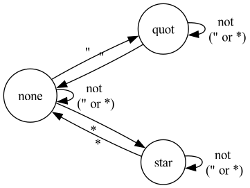
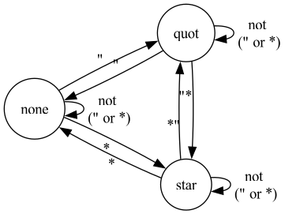
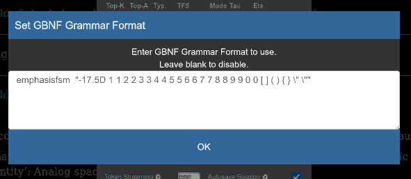
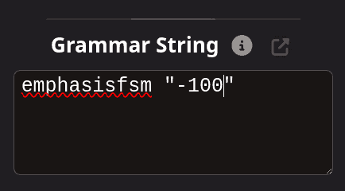

# KoboldCpp Experimental

## Emphasisfsm

The common problem during text generiation are misplaced emphasis characters.

    *looks at you "why* this is here?"

while it should be

    *looks at you* "why this is here?"

This emphasisfsm solves this by simple (and fast) grammar expressed by deterministic finite state machine.



Single letters are not practical in LLMs as tokens often contains more than one.

Emphasisfsm uses LLM tokens as its alphabet making it very fast.



Those are only most obvious examples. There are more, eg. ' "***' is a valid token to transition from qout to star. and '*this' is vaild for quot->none or none->quot.

### Usage

To support variety of GUIs this extension shamefully exploits GBNF grammar string. *This is not a proper GBNF grammar, it only uses the field which is easily editable in most GUIs*

 


    emphasisfsm "_bias_[D][_emph1_][,_emphn_]"

Empty string emphasisfsm is disabled. The easiest way to enable is to

    emphasisfsm "-20"

which defaults to

    emphasisfsm "-20 \" \" * *"

(no debug, only * and " are considered)


### how it works

Main loop is extended from:

- retrieve logits
- sample logits, select token (top_k and friends)
- output token

to

- retrieve logits
- ban forbidden emphasisfsm transitions from current state (stetting their logits low)
- sample logits, select token (top_k and friends)
- emphasisfsm trasition on selected token
- output token


### TODO

- find split utf8 letters over more than one token (i don't plant to support it, but warning would be nice)
- banning end tokens generation inside of emphasis - forcing LLM to finsh his 'thought' ?


### Meta-Llama-3-8B stats for default (" *) emphasisfsm

    empcats_gen: ban bias: -17.500000
    empcats_gen: emphasis indifferent tokens: 126802
    empcats_gen: tokens for emphasis '"' '"': 1137
    empcats_gen: tokens for emphasis '*' '*': 315
    empcats_gen: always banned tokens: 2
    empcats_gen: total tokens: 128256

Always banned tokens are :

<pre>' "*"',  ' "*"'</pre>

### Tests

    emphasisfsm "-20 1 1 2 2 3 3 4 4 5 5 6 6 7 7 8 8 9 9 0 0"

This forces that every digit is a citation, so example text completion looks like:


```
Give me math vector of random numbers.Here is a 3-dimensional math vector with random numbers:


Vector:
[
    3.445,
    -5.117,
    7.992
]
```

There is no other digit between two 3, two 4, two 5 and so on....

